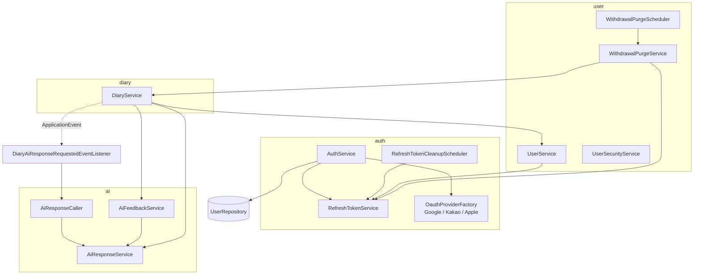
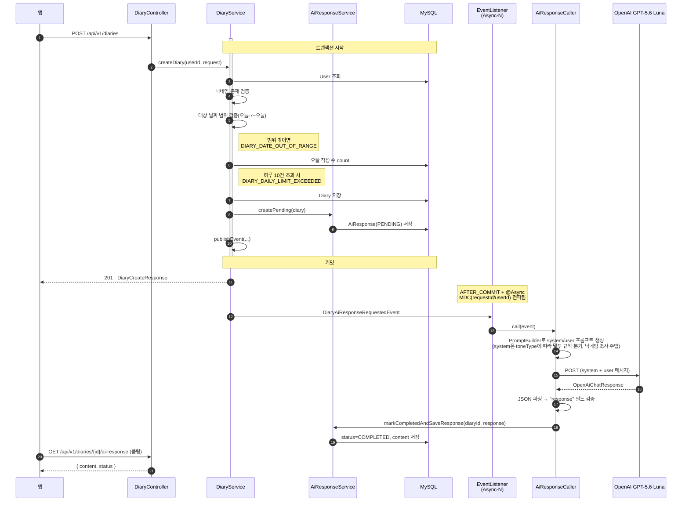
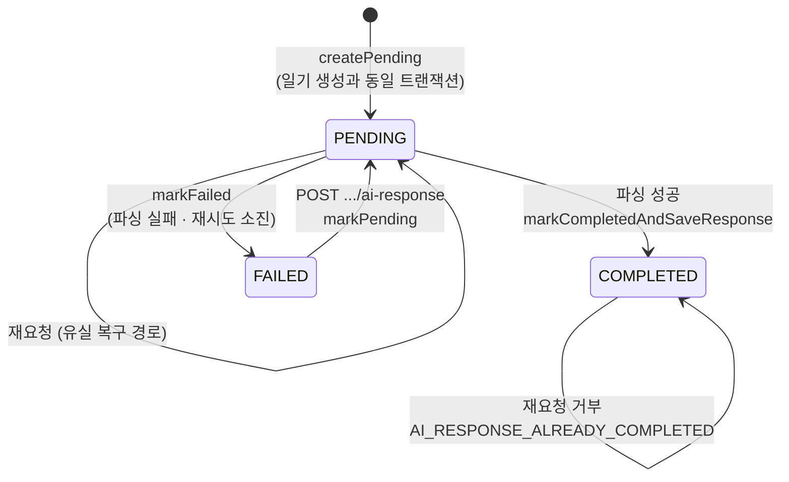
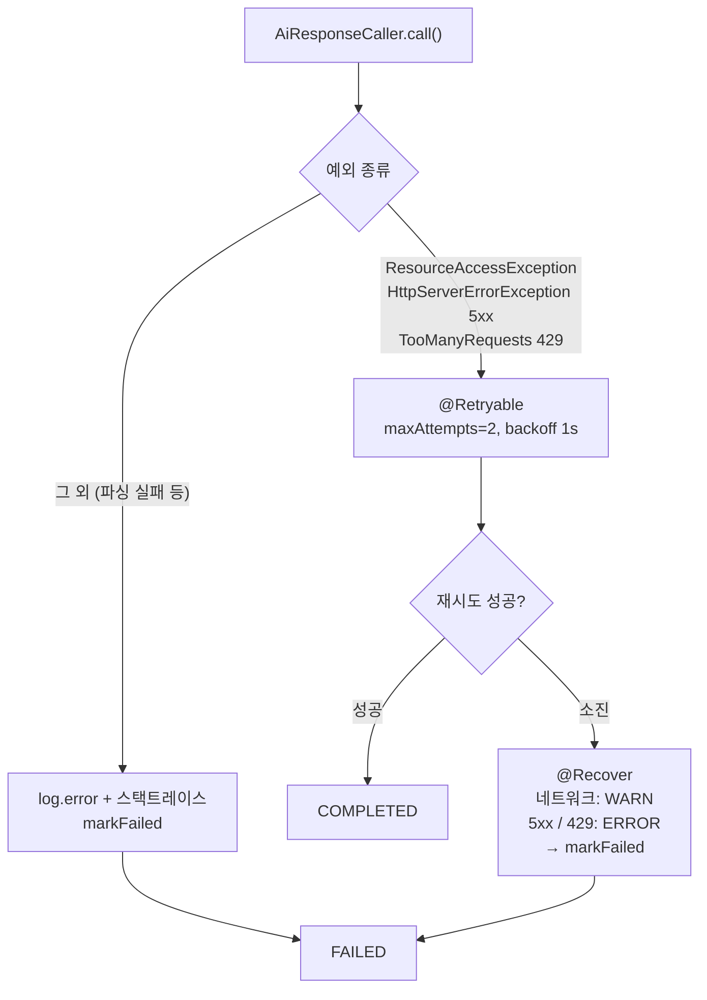
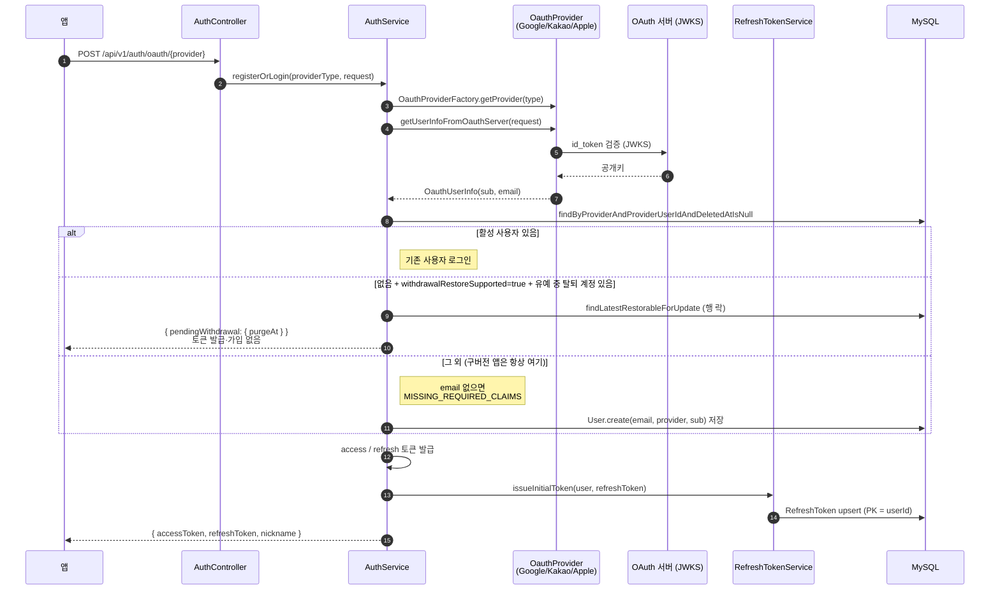
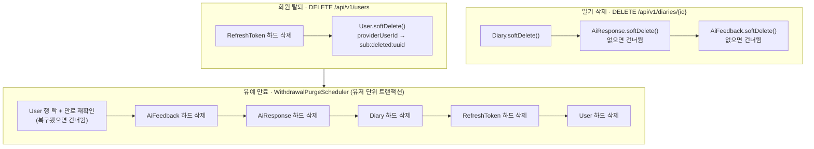

# 아키텍처 — 런타임 흐름

이 문서는 **"요청이 들어와서 무슨 일이 벌어지는가"**를 다룬다.
코딩 컨벤션·명명 규칙·커밋 규칙은 [`CLAUDE.md`](../CLAUDE.md)에 있고 여기서 반복하지 않는다.

- **대상** — 새로 합류한 사람, 오랜만에 돌아온 본인, 그리고 코딩 에이전트
- **갱신 시점** — 도메인 간 호출·이벤트·상태 전이가 바뀔 때. 메서드 시그니처 변경 정도로는 갱신하지 않는다

---

## 1. 시스템 개요

```mermaid
graph LR
    App[모바일 앱<br/>iOS / Android]

    subgraph Backend["hearu-backend (Spring Boot 3.5.7 / Java 21)"]
        API[REST API<br/>/api/v1/**]
        Async[Async 워커 풀<br/>Async-*]
        Sched[스케줄러<br/>@Scheduled]
    end

    DB[(MySQL)]
    OpenAI[OpenAI GPT-5.6 Luna<br/>LLM]
    OAuth[Google / Kakao / Apple<br/>JWKS · 토큰 검증]
    Discord[Discord Webhook]

    App -->|JWT| API
    API --> DB
    API -.이벤트.-> Async
    Async --> OpenAI
    Async --> DB
    Sched --> DB
    Sched -->|실패 시| Discord
    API --> OAuth
```

**외부 의존은 4개**이고 전부 타임아웃이 걸려 있다. 타임아웃 없는 클라이언트를 추가하지 않는다 —
지연 시 호출 스레드가 무한 대기해 풀 고갈로 이어진다.

| 대상 | 클라이언트 | connect / read |
|---|---|---|
| OpenAI GPT-5.6 Luna | `aiRestClient` (`RestClientConfig`) | 3s / 20s |
| Discord | `discordRestClient` (`RestClientConfig`) | 3s / 5s |
| OAuth JWKS | `JwksRestTemplateFactory` | 설정 참조 |

---

## 2. 요청 파이프라인

```mermaid
graph TD
    Req[HTTP 요청] --> Mdc

    Mdc["<b>MdcLoggingFilter</b><br/>@Order(HIGHEST_PRECEDENCE)<br/>requestId 생성 · REQ Start/End<br/>/actuator/** 는 제외"]
    Mdc --> Chain

    subgraph Chain["Spring Security FilterChain (STATELESS)"]
        direction TB
        ETF[ExceptionTranslationFilter] --> Jwt
        Jwt["<b>JwtFilter</b><br/>Bearer 파싱 → access token 검증<br/>SecurityContext 세팅 + MDC userId"]
        Jwt --> Authz["authorizeHttpRequests<br/>permitAll / hasRole(USER) / denyAll"]
    end

    Chain --> Ctrl["@RestController<br/>@AuthenticationPrincipal Long userId"]
    Ctrl --> Svc[Service<br/>@Transactional]
    Svc --> Repo[Repository]
    Repo --> DB[(MySQL)]

    Ctrl -. 예외 .-> GEH["GlobalExceptionHandler<br/>BusinessException → ErrorResponse"]
    Chain -. 인증/인가 실패 .-> SEC["CustomAuthenticationEntryPoint 401<br/>CustomAccessDeniedHandler 403"]
```

**핵심 두 가지:**

1. **`MdcLoggingFilter`가 `JwtFilter`보다 먼저 실행된다.** 그래서 `[REQ][Start]` 로그에는 `userId`가 아직
   없고, 인증 이후 로그부터 붙는다. 요청 종료 시 `MDC.clear()`로 정리한다.
2. **토큰이 없거나 access token이 아니면 예외를 던지지 않고 익명으로 통과시킨다.** 실제 거부는
   `authorizeHttpRequests`에서 401/403으로 일어난다. 서명/만료/형식 오류와 **`iss` 불일치·누락**만
   `BadCredentialsException`으로 승격된다. `iss`는 환경별(`hearu-local`/`dev`/`prod`, `jwt.issuer`)로 넣고
   검증 시 일치를 요구한다. 서명 키가 환경 간에 공유되더라도 dev 발급 토큰이 prod에서 통과하지 않게 하는
   방어선이다(키 분리를 대체하지 않는다: 키를 아는 쪽은 `iss`도 위조할 수 있다). 불일치는 401 `INVALID_JWT_ISSUER`.

**인가 규칙** (`SecurityConfig`) — 위에서부터 먼저 매칭되는 것이 이긴다.

| 경로 | 규칙 |
|---|---|
| `/actuator/health`, `/swagger-ui/**`, `/v3/api-docs/**` | permitAll |
| `POST /api/v1/auth/**` | permitAll |
| `/api/v1/diaries/**`, `/api/v1/users/**` | `hasRole(USER)` |
| 그 외 `/api/**` | authenticated |
| 나머지 전부 | **denyAll** |

---

## 3. 도메인 지도



**의존 방향 규칙:**

- `diary` → `ai`는 있지만 **`ai` → `diary`는 서비스 레벨에서 없다.** AI 쪽은 이벤트(`DiaryAiResponseRequestedEvent`)로
  필요한 값을 통째로 받는다. 이벤트가 `diaryId`뿐 아니라 `content`·`emotionType`·`nickname`·`toneType`까지
  들고 다니는 이유가 이것이다.
- `ai` → `user`는 **`ToneType` enum 참조 하나뿐이다**(`PromptBuilder`, 이벤트 레코드). `AiResponseCaller`가
  실행 중 `UserService`를 호출하지 않는다 — 말투 값은 이벤트 발행 시점에 확정되어 실려 온다.
- `AiFeedbackService` → `AiResponseService` 방향이 이미 있으므로, **AI 응답 삭제가 피드백을 연쇄
  삭제하면 순환이 된다.** 그래서 soft delete 전파는 `DiaryService.deleteDiary`, 탈퇴 유저의 하드 삭제는
  `DiaryService.hardDeleteAllByUserId` — 하위 데이터 삭제는 `DiaryService` 한 곳이 관장한다.
- `DiaryService` → `UserService` 방향이 이미 있으므로, **탈퇴 유저 하드 삭제는 `UserService`가 아니라
  별도 빈 `WithdrawalPurgeService`가 맡는다**(`UserService`가 `DiaryService`를 부르면 순환).
- `auth`는 `UserService`가 아니라 `UserRepository`를 직접 쓴다(로그인은 사용자 생성까지 포함하므로).

---

## 4. 핵심 흐름

### 4.1 일기 작성 → AI 응답 (이 서비스의 중심 흐름)



**여기서 반드시 알아야 할 것:**

| 사실 | 왜 중요한가 |
|---|---|
| 응답은 **커밋 이후**(`AFTER_COMMIT`)에 시작된다 | 일기 저장이 롤백되면 LLM 호출도 일어나지 않는다 |
| API는 AI 응답을 **기다리지 않는다** | 클라이언트는 `GET .../ai-response`를 **폴링**해 상태를 확인한다 |
| `PENDING` 행이 **일기 저장과 같은 트랜잭션**에서 만들어진다 | 폴링이 "아직 없음"이 아니라 "처리 중"을 볼 수 있다 |
| `MdcTaskDecorator`가 MDC를 워커로 전파한다 | 작성 요청부터 AI 완료까지 **`requestId` 하나로 추적**된다 |
| 말투(`toneType`)는 **이벤트 발행 시점의 값**으로 굳는다 | 응답 생성 중 사용자가 설정을 바꿔도 진행 중인 응답에는 반영되지 않는다 |
| 일기는 **과거 날짜(오늘-7~오늘)로 작성**할 수 있고, 표시 날짜는 `diaryDate`(제출 시각 `createdAt`과 분리) | 캘린더는 `diaryDate` 기준으로 보여주고, 하루 10건 제한·오늘 작성 수는 `createdAt`(제출일) 기준으로 센다 — 과거 날짜 일기도 오늘 작성분에 포함된다 |

### 4.2 AI 응답 상태 기계



- **`COMPLETED`는 종착점이다.** 재요청은 거부된다 — 기존 응답 보존 + 불필요한 LLM 과금 방지.
- **`PENDING` 상태에서의 재요청은 허용한다.** 큐 포화나 재배포로 유실된 작업을 사용자가 되살릴 수 있는
  유일한 경로이기 때문이다(§5 참고).

### 4.3 실패 처리 — 재시도 대상과 아닌 것



`maxAttempts = 2`는 **최초 1회 + 재시도 1회**다. `@Retryable`이 동작하려면 프록시를 거쳐야 하므로
`AiResponseCaller`가 리스너와 **별도 빈**으로 분리되어 있다(자기 호출이면 재시도가 안 걸린다).

### 4.4 OAuth 로그인 / 가입



**탈퇴 계정 복구** — `POST /api/v1/auth/oauth/{provider}/restore` (같은 `idToken`)

```
1. id_token 검증 (로그인과 동일)
2. 활성 사용자가 있으면 복구하지 않고 그 계정으로 로그인 (중복 요청 / 유예 중 이미 재가입)
3. 유예 중 탈퇴 계정 중 최신 1건을 행 락으로 조회 — 없으면 WITHDRAWAL_NOT_RESTORABLE(404)
4. User.restore(sub) — deletedAt=null, providerUserId를 원래 sub로
5. access / refresh 토큰 발급
```

**주의 지점:**

- **`email`은 신규 가입 시에만 필수다.** Apple은 최초 인증에서만 email claim을 내려주므로,
  재로그인 시 email이 없다고 실패시키면 안 된다.
- `RefreshToken`의 **PK가 `userId`** 라서 사용자당 세션이 1개다. 새 로그인은 기존 토큰을 덮어쓴다.
- **복구는 앱이 명시적으로 요청할 때만 한다.** `withdrawalRestoreSupported`를 보내지 않는 구버전 앱은
  유예 중이어도 기존처럼 신규 가입된다(복구 안내 화면이 없어 사용자 모르게 되살리지 않기 위해).
  `pendingWithdrawal`은 null이면 JSON 키 자체가 빠져, 구버전 앱이 받는 응답은 바뀌지 않는다.
- 서버는 id_token의 재사용(nonce·jti)을 막지 않으므로, 로그인과 복구에 **같은 id_token을 쓸 수 있다.**
  만료됐으면 provider 검증에서 401이 나고, 앱은 소셜 로그인을 다시 해야 한다.
- `RefreshToken`은 **`BaseEntity`를 상속하지 않는다**(만료 시 하드 삭제 대상). 의도된 예외이며
  새 엔티티의 선례로 삼지 않는다.

### 4.5 토큰 재발급

```
POST /api/v1/auth/token/refresh
  1. RefreshTokenPolicy.validateAndGetClaims  — 서명·만료·iss·타입 검증
  2. DB의 저장된 토큰과 문자열 일치 검증        — 탈취된 구 토큰 차단
  3. access / refresh 재발급 (회전)
  4. 저장된 행을 새 토큰·새 만료로 갱신
```

### 4.6 삭제 흐름 — 무엇이 soft이고 무엇이 hard인가



- 삭제 전파를 **`DiaryService.deleteDiary` 한 곳**에 모은 것은 순환 참조 회피 때문이다(§3).
- AI 응답/피드백이 없어도 삭제는 성공해야 하므로 **없으면 예외 없이 건너뛴다.**
- **회원 탈퇴는 유예 기간(`user.withdrawal.grace-period`, base 24h · prod 14d) 동안 `User`만 soft delete한다.** 일기·AI 응답·
  피드백은 그대로 두어 복구 시 되살아난다. 유예가 지나면 스케줄러가 사용자의 데이터를 **soft delete 여부와
  관계없이 전부** 하드 삭제한다.
- 하드 삭제 순서는 **피드백 → AI 응답 → 일기 → refresh token → 유저**다. FK에 `ON DELETE`가 없어
  부모부터 지우면 실패한다.
- 유예 판정은 `WithdrawalPolicy`의 cutoff(`now - 유예 기간`) 하나로 나눈다. `deletedAt >= cutoff`면 복구 가능,
  `deletedAt < cutoff`면 삭제 대상 — 반열린 구간이라 겹치지 않는다. 복구와 삭제는 같은 `User` 행 락을 잡아
  직렬화되고, 삭제 쪽은 락을 잡은 뒤 조건을 다시 확인한다.
- **탈퇴 시 `providerUserId`를 `sub:deleted:<uuid>`로 바꾸는 동작은 유지한다.** 유니크 키를 비워 재가입을
  허용하고, 이 기능이 없는 구 서버(롤백)가 같은 sub로 가입할 때 유니크 키 위반이 나지 않게 하기 위해서다.
  복구 대상은 `sub:deleted:` 접두사로 찾는다.
- **탈퇴해도 이미 발급된 access token은 만료까지 유효하다.** `JwtFilter`는 DB를 조회하지 않고, 일기
  조회 경로도 사용자 존재를 확인하지 않는다(`getUserOrThrow`는 `createDiary`·`requestAiResponse`에만
  있다). 그래서 탈퇴 직후 토큰 만료 전까지는 본인 일기가 계속 조회된다. 유예 중 피드백 작성 등으로
  하드 삭제가 FK 위반으로 실패하면 그 유저만 다음 실행에서 다시 시도된다.

### 4.7 스케줄러

```
RefreshTokenCleanupScheduler   cron: 0 0 3 * * *  (매일 03:00)
  → RefreshTokenService.deleteExpiredRefreshTokens()   @Transactional
  → DataAccessException이면 @Retryable로 1회 재시도
  → 소진 시 @Recover → log.error + Discord 알림

WithdrawalPurgeScheduler       cron: 0 0 4 * * *  (매일 04:00)
  → WithdrawalPurgeService.findPurgeTargetIds(cutoff)  최대 500명, 오래된 순
  → 유저마다 WithdrawalPurgeService.purge()            @Transactional (유저 단위)
  → 실패한 유저는 log.error 후 계속, 끝나고 Discord 알림 — 다음 실행에서 자동 재시도
```

**`@Retryable`은 스케줄러(비트랜잭션)에, `@Transactional`은 서비스에 둔다.** 한 메서드에 겹치면
롤백된 트랜잭션 안에서 재시도가 도는 위험이 있다. `AiResponseCaller`와 동일한 패턴이다.

`WithdrawalPurgeScheduler`는 `@Retryable`이 없다. 실패한 유저는 대상 조건을 그대로 만족해 다음 실행이
다시 집어 가고, 유저 단위 트랜잭션이라 한 명의 실패가 나머지를 막지 않는다. 두 스케줄러 모두 분산 락이
없어 **단일 인스턴스 전제**다(삭제 쪽은 행 락 + 재확인이라 중복 실행돼도 결과는 같다).

---

## 5. 비동기 워커 — 알아야 할 한계

```java
// AsyncConfig
corePoolSize   5
maxPoolSize    10
queueCapacity  30
waitForTasksToCompleteOnShutdown  true
awaitTerminationSeconds           30
```

동시에 처리 가능한 AI 요청은 **최대 10건 + 대기 30건**이다. 그 이상은 `ThreadPoolTaskExecutor`의
기본 거부 정책에 걸려 **작업이 버려지고, 해당 일기는 `PENDING`에 머문다.** 이것이
`markPending`이 `PENDING → PENDING` 재요청을 허용하는 이유다.

배포 시에는 `waitForTasksToCompleteOnShutdown`으로 큐를 비우고 나간다.
**`compose`의 `stop_grace_period`가 `awaitTerminationSeconds`(30s)보다 커야** SIGKILL이 먼저 오지 않는다.

다만 이 대기는 **재배포로 인한 유실만** 막는다. 큐 포화·강제 종료·`markFailed` 자체의 실패로 고착된
`PENDING`은 그대로 남는다.

관련 미결 과제:
- [`docs/plan/ai-response-stuck-sweep.md`](plan/ai-response-stuck-sweep.md) — 오래 `PENDING`인 응답 정리

---

## 6. 횡단 관심사

| 관심사 | 구현 | 흐름상 위치 |
|---|---|---|
| 요청 추적 | `MdcLoggingFilter`(requestId) + `JwtFilter`(userId) + `MdcTaskDecorator`(비동기 전파) | 파이프라인 최외곽 → 워커까지 |
| 민감정보 | `LogMasker` — 일기 본문·이메일·OAuth `sub`. 환경 분기 없이 **항상** 마스킹 | 서비스·클라이언트 로그 전역 |
| 예외 | 도메인별 `ErrorCode` → `BusinessException` → `GlobalExceptionHandler` | 컨트롤러 바깥 |
| 인증 실패 | `CustomAuthenticationEntryPoint`(401) / `CustomAccessDeniedHandler`(403) | 시큐리티 체인 내부 |
| 응답 래핑 | `ApiResponse.success(...)`. 단 `DELETE`는 `ResponseEntity<Void>` + 204 | 컨트롤러 |
| 스키마 | Flyway `db/migration/V*.sql`, `ddl-auto=validate` 고정 | 기동 시점 |

**로그 태그** — AI 흐름은 `[AI][*]` 태그로 검색 가능하게 통일되어 있다.
태그 목록과 규칙은 [`.claude/rules/logging.md`](../.claude/rules/logging.md)가 갖는다.

---

## 7. API 표면

**이 표는 지도이지 명세가 아니다.** 엔드포인트의 진실은 Swagger UI(`/swagger-ui.html`)이고, 여기에는
"어떤 도메인에 무엇이 있는지"와 흐름상 주의점만 적는다. 요청/응답 스키마·검증 규칙·에러 코드는 적지 않는다
(적는 순간 코드와 어긋나기 시작한다). 표와 Swagger가 다르면 **Swagger가 맞다.**

| 도메인 | 메서드 · 경로 | 비고 |
|---|---|---|
| auth | `POST /api/v1/auth/oauth/{provider}` | permitAll · 가입 겸 로그인 · `withdrawalRestoreSupported`면 유예 중 계정 안내 |
| auth | `POST /api/v1/auth/oauth/{provider}/restore` | permitAll · 유예 중 탈퇴 계정 복구 |
| auth | `POST /api/v1/auth/token/refresh` | permitAll · 토큰 회전 |
| diary | `POST /api/v1/diaries` | 하루 10건 제한(제출일 기준) · 과거 7일 backdating · AI 이벤트 발행 |
| diary | `GET /api/v1/diaries/{diaryId}` | |
| diary | `GET /api/v1/diaries/today/count` | 제출일(`createdAt`) 기준 |
| diary | `GET /api/v1/diaries/calendar` | DTO 직접 조회 · `diaryDate`(대상 날짜) 기준 |
| diary | `DELETE /api/v1/diaries/{diaryId}` | 204 · AI 응답·피드백 전파 |
| ai-response | `POST /api/v1/diaries/{diaryId}/ai-response` | 재요청 · COMPLETED면 거부 · **`DiaryController`** |
| ai-response | `GET /api/v1/diaries/{diaryId}/ai-response` | **폴링 대상** · **`DiaryController`** |
| ai-feedback | `POST /api/v1/diaries/{diaryId}/ai-response/feedbacks` | upsert |
| user | `GET /api/v1/users/profile` | |
| user | `PATCH /api/v1/users/nickname` | |
| user | `PATCH /api/v1/users/ai-settings` | `toneType` |
| user | `POST /api/v1/users/logout` | refresh token 삭제 |
| user | `DELETE /api/v1/users` | 204 · 탈퇴(유예 시작) |
| user | `PATCH /api/v1/users/lock-setting/{enable,disable,password}` | 앱 잠금 |
| user | `POST /api/v1/users/lock-setting/verify` | 앱 잠금 검증 |

**`ai-response` 도메인에는 컨트롤러가 없다(의도된 예외).** 두 엔드포인트는 `/api/v1/diaries` 하위
경로라 `DiaryController`가 `AiResponseService`를 직접 주입받아 서빙한다 — 같은 prefix를 두 컨트롤러가
나눠 갖지 않기 위한 것이다. 표에서 도메인 열은 **기능이 속한 곳**이고, 코드 위치는 비고를 본다.
`ai-feedback`은 자체 `AiFeedbackController`를 갖는다.

상세 스펙은 Swagger UI(`/swagger-ui.html`)와
[`docs/hearu-api-postman-collection.json`](hearu-api-postman-collection.json)을 본다.
